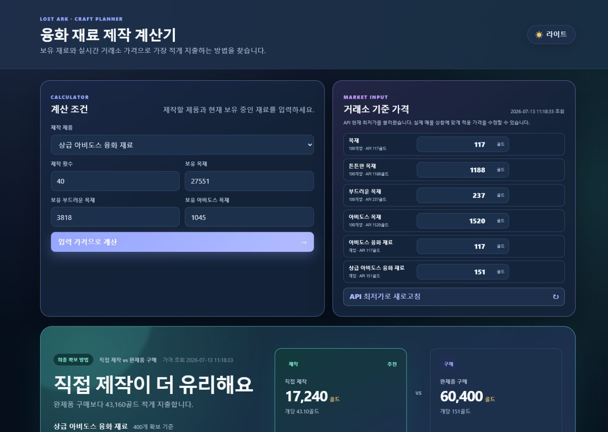
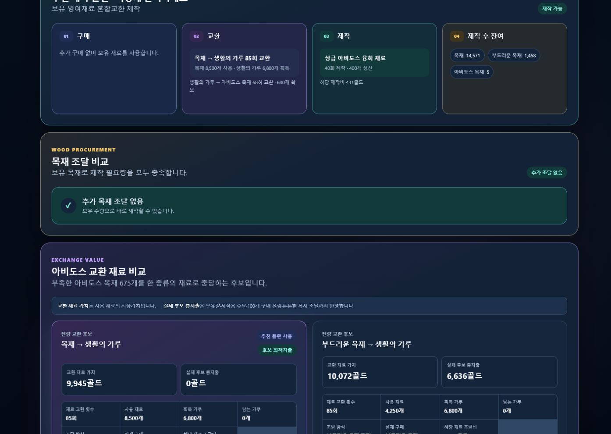

# 로스트아크 융화 재료 제작 계산기

로스트아크 생활 재료의 거래소 가격과 보유 수량을 기준으로, 융화 재료를 제작하는 데 필요한 **실제 추가 지출과 최저비용 조달 방법**을 계산하는 Flask 웹 애플리케이션입니다.

단순한 개당 가격 비교가 아니라 거래소의 묶음 구매 단위, 생활 재료 교환 단위, 보유 재료, 제작 비용을 함께 반영해 실제 게임에서 실행 가능한 계획을 제공합니다.

## 화면





## 개발 배경

융화 재료를 제작할 때는 다음 요소를 함께 고려해야 합니다.

- 현재 보유 중인 목재와 아비도스 목재
- 거래소의 100개 묶음 구매 단위
- 목재와 부드러운 목재의 생활의 가루 교환 효율
- 튼튼한 목재를 통한 목재 조달
- 제작 횟수에 따른 총 생산량과 제작비
- 동일 수량의 완제품을 거래소에서 구매하는 비용

기존에는 이 값을 직접 계산해야 했고, 단가만 비교하면 실제 구매 단위 때문에 잘못된 결론이 나올 수 있었습니다. 이 프로젝트는 가능한 조달 후보를 각각 계산한 뒤 **실제 추가 지출이 가장 낮은 제작 플랜**을 선택하도록 만들었습니다.

## 주요 기능

### 제작 계획 계산

- 아비도스 융화 재료와 상급 아비도스 융화 재료 지원
- 사용자가 입력한 제작 횟수에 따라 필요 재료와 생산량 계산
- 보유 재료를 먼저 사용하고 부족한 재료만 조달
- 제작 후 남는 재료와 구매 후 잔여 재료 표시

### 재료 조달 후보 비교

- 부족한 목재 직접 구매
- 튼튼한 목재 구매 후 목재로 교환
- 목재를 생활의 가루로 교환한 뒤 아비도스 목재 확보
- 부드러운 목재를 생활의 가루로 교환한 뒤 아비도스 목재 확보
- 보유 잉여 재료를 사용한 혼합 교환
- 제작용 재료와 교환용 재료의 수요를 합산한 실제 구매 비용 비교

### 직접 제작과 완제품 구매 비교

- 요청한 제작 횟수에 따른 총 생산량 계산
- 부족 재료 조달비와 제작비를 합산한 직접 제작 총지출 계산
- 같은 수량의 완제품 거래소 구매 비용 계산
- 두 방식의 차액과 추천 방법 표시

### 거래소 가격 입력

- 로스트아크 Open API에서 현재 최저가 조회
- 최근가와 전일 평균가를 제외하고 `CurrentMinPrice`만 초기값으로 사용
- 화면에서 계산 적용 가격을 직접 수정 가능
- 계산 요청 시 화면에 입력된 가격을 사용
- `API 최저가로 새로고침`을 눌렀을 때만 가격 재조회

### 사용자 화면

- 서버 렌더링 기반 Flask 폼
- 다크·라이트 테마
- 데스크톱과 모바일 반응형 레이아웃
- 추천 플랜, 목재 조달 비교, 교환 재료 가치 비교를 영역별로 표시

## 핵심 계산 규칙

### 거래소 구매 단위

- 목재류와 아비도스 목재는 100개 단위로 구매합니다.
- 부족 수량은 100개 단위로 올림 처리합니다.
- 완제품 융화 재료는 개당 가격으로 계산합니다.

```text
구매 수량 = ceil(부족 수량 / 100) × 100
```

### 생활의 가루 교환

```text
목재 100개        → 생활의 가루 80개
부드러운 목재 50개 → 생활의 가루 80개
생활의 가루 100개  → 아비도스 목재 10개
```

필요 가루를 충족할 수 있도록 실제 교환 횟수를 올림 처리하고, 교환 후 남는 가루도 계산합니다.

### 튼튼한 목재 교환

```text
튼튼한 목재 5개 → 목재 50개
```

- 튼튼한 목재는 거래소에서 100개 단위로 구매합니다.
- 필요한 목재 전체를 직접 구매하는 방법과 튼튼한 목재로 전량 교환하는 방법을 비교합니다.
- 두 방식을 섞는 복합 조달은 사용하지 않습니다.

### 비용 평가 기준

기본 추천 기준은 사용자가 지금 추가로 지출해야 하는 골드입니다.

- 보유 중인 재료는 실제 구매 비용에 포함하지 않습니다.
- 부족한 재료만 구매 또는 교환 대상으로 계산합니다.
- 구매 묶음 올림과 교환 단위를 반영한 실제 비용으로 후보를 비교합니다.
- 보유 재료를 소비하는 플랜은 별도로 `교환 재료 가치`를 표시해 기회비용을 확인할 수 있습니다.

## 지원 레시피

| 제작 대상 | 1회 생산량 | 1회 제작비 | 1회 필요 재료 |
|---|---:|---:|---|
| 아비도스 융화 재료 | 10개 | 332골드 | 목재 86, 부드러운 목재 45, 아비도스 목재 33 |
| 상급 아비도스 융화 재료 | 10개 | 431골드 | 목재 112, 부드러운 목재 59, 아비도스 목재 43 |

## 기술 스택

- Python 3.12+
- Flask
- Requests
- python-dotenv
- HTML / CSS / Vanilla JavaScript
- unittest
- uv

## 프로젝트 구조

```text
.
├─ main.py                       # 애플리케이션 진입점
├─ web_app.py                    # Flask 요청 처리와 화면용 데이터 구성
├─ src/
│  ├─ constants.py              # 레시피, 교환 규칙, 가격 입력 설정
│  ├─ lostark_api.py            # 로스트아크 거래소 API 요청
│  ├─ market_prices.py          # 계산에 필요한 품목 가격 조회
│  ├─ price_parser.py           # API 가격 응답 파싱
│  ├─ price_utils.py            # 계산 가격표와 교환 단가 계산
│  ├─ material_utils.py         # 필요량, 부족량, 잔여량 계산
│  ├─ exchange_calculator.py    # 생활의 가루 교환 계획 계산
│  ├─ purchase_calculator.py    # 구매·교환 조달 후보 생성
│  ├─ plan_calculator.py        # 전체 제작 플랜 생성
│  └─ plan_selector.py          # 최저비용 플랜 선택
├─ templates/index.html         # 서버 렌더링 화면
├─ static/style.css             # 반응형 UI와 테마
├─ static/theme.js              # 테마 전환과 저장
└─ tests/test.py                # 계산 및 웹 통합 테스트
```

계산 책임을 API 조회, 재료 연산, 교환, 구매 후보, 전체 플랜 선택 단계로 분리했습니다. 웹 계층은 계산 모듈이 만든 결과를 화면용 데이터로 변환하는 역할을 담당합니다.

## 실행 방법

### 1. 저장소 복제

```bash
git clone https://github.com/kwangs7243/lostark-auction-collector.git
cd lostark-auction-collector
```

### 2. 의존성 설치

[uv](https://docs.astral.sh/uv/)가 설치되어 있어야 합니다.

```bash
uv sync
```

### 3. API 키 설정

[로스트아크 Open API](https://developer-lostark.game.onstove.com/)에서 API 키를 발급받은 뒤 프로젝트 루트에 `.env` 파일을 생성합니다.

```env
api_key=발급받은_API_키
```

`.env`는 Git 추적 대상에서 제외됩니다.

### 4. 서버 실행

```bash
uv run python main.py
```

Windows에서는 `run_web.bat`를 실행할 수도 있습니다.

브라우저에서 다음 주소로 접속합니다.

```text
http://127.0.0.1:5000
```

## 테스트

```bash
uv run python -m unittest discover -s tests -v
```

현재 테스트는 다음 범위를 검증합니다.

- 레시피별 필요 재료 계산
- 현재 최저가 전용 가격 계산
- 목재 100개 구매 올림 경계값
- 튼튼한 목재 교환 및 구매 단위
- 제작용·교환용 목재 수요 합산
- 부드러운 목재 구매 묶음 합산
- 보유 잉여 재료를 반영한 교환 후보
- 제작 횟수에 따른 제작비와 완제품 구매 비교
- 사용자 입력 가격 적용과 API 재조회 분리
- Flask 화면의 주요 결과 렌더링

## 주요 설계 결정

### 실제 지출과 재료 가치를 분리

보유 재료는 이미 가지고 있으므로 추천 플랜의 구매 비용에는 포함하지 않았습니다. 다만 보유 재료를 소비하는 경제적 가치를 확인할 수 있도록 시장가 기준의 교환 재료 가치를 별도 지표로 제공합니다.

### 후보를 먼저 완성한 뒤 비교

단순 환산 단가만으로 교환 재료를 선택하지 않습니다. 각 후보에 대해 제작용 수요와 교환용 수요를 합치고, 보유량과 구매 단위까지 반영한 완성된 구매 계획을 만든 뒤 총지출을 비교합니다.

### 서버 렌더링 구조 유지

개인용 도구의 사용 빈도와 복잡도를 고려해 별도의 AJAX 상태 관리를 추가하지 않았습니다. Flask 폼 요청과 서버 렌더링만으로 가격 입력과 결과 계산 흐름을 구성했습니다.

## 향후 개선 아이디어

- 실제 사용 피드백을 반영한 정보 우선순위 개선
- 거래소 API 장애 시 마지막 정상 가격 캐시
- 계산 결과 공유 또는 저장
- 테스트 케이스와 계산 근거 문서 확장

## 개발 및 학습 문서

프로젝트의 설계 배경, 코드 학습 순서, 다른 개발 환경에서 이어서 작업하기 위한 내용은 [포트폴리오 인수인계 문서](docs/PORTFOLIO_HANDOFF.md)에 정리했습니다.
